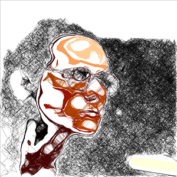

# Extentio 1.5b

**Disclaimer 1: This version of Extentio does not include the AI model for facial detection. When you install OpenCV library, it includes a series of pre-trained models, which you may use at your own will and risk. I am not responsible for accuracy and bias of these models.**

**Disclaimer 2: Extentio has many "aesthetic" parameters. If you wish to generate images as your own artwork, please contact me first. I'll gladly discuss aesthetic features between our works in order to establish differences.**

Welcome! Extentio is a software for automatically generated sketches, made for my Master's degree practical development. It uses a webcamera and OpenCV for face detections. When it finds a face, it is framed and zoomed in, and this will be the base for a drawing. A color palette is extracted from this framed image. Then, several "pen" agents start to sketch with short and straight lines, each with one of the extracted colors. Tracing is done by color proximity, in a way that each pen fills up areas of common shades, creating contour lines, textures and volumes. There are currently two ways to stop a sketch: one is by redetection of a face on the ongoing drawing, the other is a timeout parameter. Whichever happens first, a drawing is then complete. Some drawings produced with Extentio can be seen below or in my website http://sergiovenancio.art

## Installation & Running

You will need:
- Processing 3+ (Java mode). Download it [here](http://processing.org/download).
- Video library. Install it in Processing by acessing Sketch > Import Library > Video
- OpenCV library. Install it in Processing by acessing Sketch > Import Library > Add Library... and look for OpenCV by [Greg Borenstein](https://github.com/atduskgreg/opencv-processing)

For hardware, you'll only need a USB webcam. I recommend Logitech C920 fullHD camera. You'll notice that the drawings might use a lot of CPU, so be aware that the camera high resolution might be contributing to this.

**Setting up camera**

After installing all required software and plugging the camera, just hit Run on Processing window, you'll start in camera debug mode and probably you will get a camera error. Look in the console, you'll see a list of cameras, resolutions and framerates. 

Select one, copy the index number on the left, and edit this line: change the width, height, index number and framerate according to your camera.

> cam = new Capture(this, 1920, 1080, cameras[139], 30);

E.g. if your camera is 640x480, index number 3 and 30 fps, edit the line to:

> cam = new Capture(this, 640, 480, cameras[3], 30);

Try running the software again, and you should now see the captured images. 

**Drawing mode**

To put the software in drawing mode, simply go to this line of code and set this parameter to **false**

> boolean debugMode = true; //use debug mode to calibrate camera

**A few notes**

- Extentio is currently in beta, and it's a very personal software. I do not guarantee quality of code, because the way I program is very experimental. Also, I do not guarantee I'll fix issues, but feel free to report any bugs.
- To change the drawing parameters, look for instructions inside the code. Since you need to know programming in order to customize this software, I won't bother to explain it here, it would take too long.
- The images you generate might be different from the ones I showcase. I share this code with basic adjustment of parameters, but in my practice, I have different settings for the parameters. I encourage you to explore the code and discuss it with me.
